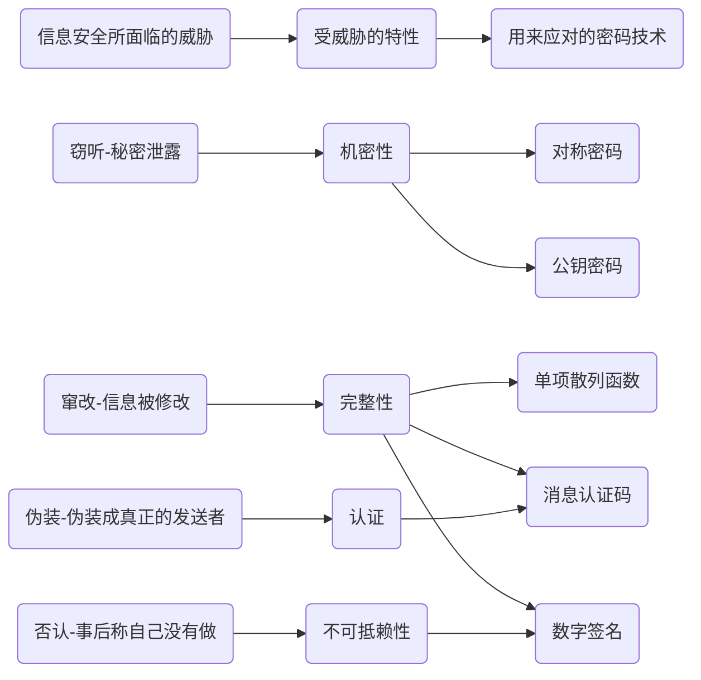
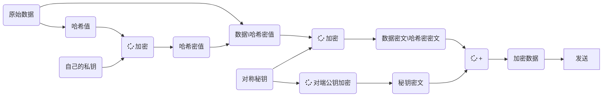
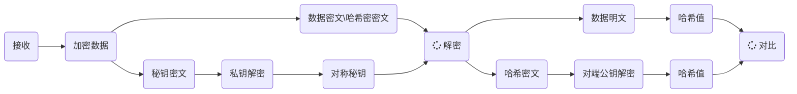

# Information security

## 加密算法介绍

随着移动互联网的发展，确确实实给大家的生活带来了很多便捷，同时随之带来的也有很多安全上的风险，互联网时代的安全风险会造成商业信息泄密、用户数据泄露，但移动互联网时代的安全风险，一部手机可能会让个人隐私信息的泄露，甚至您的财产丢失。移动互联网的发展比互联网时代更加需要信息安全，所以信息安全突然变得紧迫而重要。




### **一、加密算法的分类**

#### 1）几种对称性加密算法

DES是一种分组数据加密技术（先将数据分成固定长度的小数据块，之后进行加密），速度较快，适用于大量数据加密，而3DES是一种基于DES的加密算法，使用3个不同密匙对同一个分组数据块进行3次加密，如此以使得密文强度更高。

相较于DES和3DES算法而言，AES算法有着更高的速度和资源使用效率，安全级别也较之更高了，被称为下一代加密标准。

SM4是我国

| 名称 | 密钥长度        | 运算速度 | 安全性 | 资源消耗 |
| ---- | --------------- | -------- | ------ | -------- |
| DES  | 56位            | 较快     | 低     | 中       |
| 3DES | 112位或168位    | 慢       | 中     | 高       |
| AES  | 128、192、256位 | 快       | 高     | 低       |
| SM4  |                 |          |        |          |


#### 2）几种非对称性加密算法

RSA和DSA的安全性及其它各方面性能都差不多，而ECC较之则有着很多的性能优越，包括处理速度，带宽要求，存储空间等等。

| 名称 | 成熟度 | 安全性(取决于密钥长度) | 运算速度 | 资源消耗                               |
| ---- | ------ | ---------------------- | -------- | -------------------------------------- |
| RSA  | 高     | 高                     | 慢       | 高                                     |
| DSA  | 高     | 高                     | 慢       | 只能用于数字签名                       |
| ECC  | 低     | 高                     | 快       | 低(计算量小,存储空间占用小,带宽要求低) |
| SM2  |        |                        |          |                                        |
| SM9  |        |                        |          |                                        |

SM2和RSA密文长度==明文长度

#### 3）几种线性散列算法

这几种算法只生成一串不可逆的密文，经常用其效验数据传输过程中是否经过修改，因为相同的生成算法对于同一明文只会生成唯一的密文，若相同算法生成的密文不同，则证明传输数据进行过了修改。通常在数据传说过程前，使用MD5和SHA1算法均需要发送和接收数据双方在数据传送之前就知道密匙生成算法，而HMAC与之不同的是需要生成一个密匙，发送方用此密匙对数据进行摘要处理（生成密文），接收方再利用此密匙对接收到的数据进行摘要处理，再判断生成的密文是否相同。

| 名称  | 安全性 | 速度 |
| ----- | ------ | ---- |
| SHA-1 | 高     | 慢   |
| MD5   | 中     | 快   |
| HMAC  |        |      |
| SM3   |        |      |

### **二、对于各种加密算法的选用：**

由于对称加密算法的密钥管理是一个复杂的过程，密钥的管理直接决定着他的安全性，因此当数据量很小时，我们可以考虑采用非对称加密算法。

在实际的操作过程中，我们通常采用的方式是：采用非对称加密算法管理对称算法的密钥，然后用对称加密算法加密数据，这样我们就集成了两类加密算法的优点，既实现了加密速度快的优点，又实现了安全方便管理密钥的优点。

如果在选定了加密算法后，那采用多少位的密钥呢？一般来说，密钥越长，运行的速度就越慢，应该根据的我们实际需要的安全级别来选择，一般来说，RSA建议采用1024位的数字，ECC建议采用160位，AES采用128为即可。

### **对称与非对称算法比较**

| 名称       | 密钥管理                             | 安全性 | 速度                                                         |
| ---------- | ------------------------------------ | ------ | ------------------------------------------------------------ |
| 对称算法   | 比较难,不适合互联网,一般用于内部系统 | 中     | 快好几个数量级(软件加解密速度至少快100倍,每秒可以加解密数M比特数据),适合大数据量的加解密处理 |
| 非对称算法 | 密钥容易管理                         | 高     | 慢,适合小数据量加解密或数据签名                              |


### 3 加密通信模型

模型大体上步骤是这样的，A要将一段数据D发送给B：

1. A将数据D做哈希，生成哈希值X；
2. A用自己的私钥给X加密，生成数据SJ；然后附加到D后变成DSJ；
3. A对DSJ用对称秘钥DS进行加密后的数据为DDSJ；
4. 用B的公钥对DS进行加密生成DSB；
5. 将DSB附加到DDSJ成为DDSJDSB后发送给B



B收到信息，它的解密步骤如下：

1. B接收到DDSJDSB后用自己的私钥对DSB解密得到秘钥DS；
2. B用对称秘钥DS解密DDSJ得到DSJ，此时拿到了数据D和加密哈希SJ；
3. B用A的公钥对SJ解密得到X；
4. B对D做哈希得到XB并和X比较，如果一致，则认为D没有被串改。



**CA的作用**

这样是不是就能够保证通信双方万无一失了呢？？看着很是天衣无缝，但是其实仔细想想，似乎哪里还有蹊跷。

Tom想跟Jerry通信，Tom是怎么获得Jerry的公钥的呢？？？？

看看，原来是如此缜密的通信机制里还有遗漏，我们仍无法保证数据够保密的。Tom和Jerry如何可靠的获得真正属于本人的公钥的？看来得找一个牢靠的第三方，一个能够保障双方身份都可靠的仲裁机构了。对，这就是CA的诞生了。

CA就是认证身份的中心，用它来确认公钥拥有者的真实身份！！它会给Tom和Jerry每个人发给类似***一样的“数字证书”。而且对于这个CA的第三方几乎没人敢怀疑它是“冒牌货”。那么CA是如何进行认证的呢？

CA会利用它自己的私钥为数字证书附加上数字签名，类似于上公安局盖上大印了一样。通常我们的CA采取x.509格式信息的数字证书,证书中包含的信息有： 

- 证书的版本信息；

- 证书的序列号，每个证书都有一个唯一的证书序列号；

- 证书所使用的签名算法；

- 证书的发行机构名称，命名规则一般采用X.500格式；

- 证书的有效期，现在通用的证书一般采用UTC时间格式；

- 证书所有人的名称，命名规则一般采用X.500格式；（这里必须要写真实的主机名）！！！

- 证书所有人的公钥。

- 证书发行者对证书的签名。

但如果Tom想申请一个证明自己公钥所有权的CA的数字证书并不是那么容易，Tom需要填写一个类似“入党申请书”一样的东西交给CA，CA进行实地考察，看看Tom三代是否有不合法的，看看Tom是不是一个品德高尚的人等等，核实成功了，CA才会签署表示同意。

## 国密加密算法

http://openstd.samr.gov.cn/bzgk/gb/index

### 概览

*SM1:一种分组密码算法,分组长度为 128 比特,密钥长度为 128 比特。(硬件,不
公开)
SM2:一种椭圆曲线公钥密码算法,其密钥长度为 256 比特 。
SM3:一种密码杂凑（哈希）算法,其输出长度为 256 比特 。
SM4:一种分组密码算法,分组长度为 128 比特,密钥长度为 128 比特 。
*SM7:一种分组密码算法,分组长度为 128 比特,密钥长度为 128 比特 。(硬件,不
公开)
SM9:一种基于身份标识的非对称密码算法。
ZUC:一种序列密码算法。(祖冲之序列密码算法)

### **SM1**

该算法是国家密码管理部门审批的 SM1 分组[密码算法](https://baike.baidu.com/item/密码算法/231826) , 分组长度和密钥长度都为 128 比特，算法安全保密强度及相关软硬件实现性能与 AES 相当，该算法不公开，仅以 IP 核的形式存在于芯片中。采用该算法已经研制了系列芯片、智能 IC 卡、智能密码钥匙、加密卡、加 密机等安全产品，广泛应用于电子政务、电子商务及国民经济的各个应用领域（包括国家政务通、[警务通](https://baike.baidu.com/item/警务通/10951816)等重要领域）。

|              | SM1                 | AES                      |
| ------------ | ------------------- | ------------------------ |
| 算法结构     | 基本椭圆曲线（ECC） | Substitution-Permutation |
| 区块长度     | 128bit              | 128bit                   |
| 密钥长度     | 128bit              | 2048-4096bit             |
| 秘钥生成速度 | 快                  | 中                       |
| 解密加密速度 | 快                  | 快                       |

### **SM2**

用途：加密，解密，签名验签，秘钥协商。

密钥对：

私钥  长度：256位。数据格式的ASN.1定义为INTEGER

公钥是SM2曲线上的一个点。由（x， y）两个分量表示，每个分量的长度位256位。数据格式的ASN.1定义为BIT STRING，内容为04 || X || Y,其中X和Y分别为x分量和y分量。

加密数据格式的ASN.1定义为

```
SM2Cipher::=SEQUENCE{
X			INTEGER,  				-X分量
Y			INTEGER, 				-Y分量
HASH		OCTET STRING SIZE(32),	-杂凑值(SM3)
CipherText	OCTET STRING,			-密文
}
```

签名数据格式：

```
SM2Signature::=SEQUENCE{
R	INTEGER,	-签名值的第一部分
S	INTEGER,	-签名值的第二部分
}
```

密钥对保护

在传递SM2密钥对时，需要对SM2密钥对进行加密保护。具体方法为：

1. 产生一个对称秘钥
2. 使用对称秘钥对私钥进行加密，得到私钥密文。若对称算法是分组算法，使用ECB模式。
3. 使用外部SM2公钥加密对称秘钥得到对称秘钥密文。
4. 将私钥密文，对称秘钥密文 封装到密钥对保护数据中。

SM2密钥对的保护数据格式的ASN.1定义为

```
SM2EnvelopedKey::=SEQUENCE{
symAlgID				algorithmidentitier,	-对称密码算法标识
symEncryptedKey			SM2Cipher,				-对称秘钥密文
Sm2PublicKey			SM2PublicKey			-SM2公钥
Sm2EncryptedPrivatKey	BIT	STRING				-SM2私钥密文
}
```

SM2加密密文等于明文长度。


在openssl中,支持sm2的公私钥的生成方法,不过其名称并不是sm2的字面意思,而是ec,

到openssl的apps文件夹下,输入命令如下所示:

```bash
$ openssl ecparam -genkey -name SM2 -out priv.key
$ openssl ec -in priv.key -pubout -out pub.key
```

其中SM2是一个曲线的名称,符合国密算法要求

SM2算法和[RSA算法](https://baike.baidu.com/item/RSA算法/263310)都是公钥密码算法SM2算法是一种更先进安全的算法，在我们国家[商用密码](https://baike.baidu.com/item/商用密码/10636778)体系中被用来替换RSA算法。SM2性能更优更安全：密码复杂度高、处理速度快、机器性能消耗更小。

|              | SM2                 | RSA                    |
| ------------ | ------------------- | ---------------------- |
| 算法结构     | 基本椭圆曲线（ECC） | 基于特殊的可逆模幂运算 |
| 计算复杂度   | 完全指数级          | 亚指数级               |
| 存储空间     | 192-256bit          | 2048-4096bit           |
| 秘钥生成速度 | 较RSA算法快百倍以上 | 慢                     |
| 解密加密速度 | 较快                | 一般                   |

### **SM3**

是摘要加密算法，国产SM3是中国国家密码管理局2010年公布的中国商用密码杂凑算法标准。SM3算法适用于商用密码应用中的数字签名和验证，是在SHA-256基础上改进实现的一种算法。SM3算法采用Merkle-Damgard结构，消息分组长度为512位，摘要值长度为256位。

|          | SM3                | Sha256                 |
| -------- | ------------------ | ---------------------- |
| 算法结构 | Merkle-Damgard结构 | 基于特殊的可逆模幂运算 |
| 消息长度 | 2^64位             | <2^64位                |
| 分组长度 | 512位              | 512位                  |
| 摘要长度 | 256位(32字节)      | 256位                  |
| 计算步骤 | 64步               | 64步                   |
| 加密速度 | 快                 | 快                     |

###  **SM4**

此算法是一个分组算法，用于无线局域网产品。该算法的分组长度为128比特，密钥长度为128比特。加密算法与密钥扩展算法都采用32轮非线性迭代结构。解密算法与加密算法的结构相同，只是轮密钥的使用顺序相反，解密轮密钥是加密轮密钥的逆序。:此算法采用非线性迭代结构，每次迭代由一个轮函数给出，其中轮函数由一个非线性变换和线性变换复合而成，非线性变换由S盒所给出。其中rki为轮密钥，合成置换T组成轮函数。轮密钥的产生与上图流程类似，由加密密钥作为输入生成，轮函数中的线性变换不同，还有些参数的区别。SM4算法的具体描述和示例见SM4标准。

|              | SM4           | 3DES                     | DES                      |
| ------------ | ------------- | ------------------------ | ------------------------ |
| 算法结构     | 非平衡Feistel | 使用标准的算术和逻辑运算 | 使用标准的算术和逻辑运算 |
| 计算轮数     | 32            | 48                       | 16                       |
| 分组长度     | 128位         | 128位                    | 64                       |
| 秘钥长度     | 128位         | 128位                    | 64                       |
| 有效秘钥长度 | 112位         | 128位                    | 56                       |
| 性能         | 快            | 中                       | 中                       |
| 安全性       | 快            | 中                       | 低                       |

密文长度==明文长度

### **SM7**

是一种分组密码算法，分组长度为128比特，密钥长度为128比特。SM7适用于非接触式IC卡，应用包括身份识别类应用(门禁卡、工作证、参赛证)，票务类应用(大型赛事门票、展会门票)，支付与通卡类应用（积分消费卡、校园一卡通、企业一卡通等）。 

### **SM9**

为了降低公开密钥系统中密钥和证书管理的复杂性，以色列科学家、RSA算法发明人之一Adi Shamir在1984年提出了标识密码（Identity-Based Cryptography）的理念。标识密码将用户的标识（如邮件地址、手机号码、QQ号码等）作为公钥，省略了交换数字证书和公钥过程，使得安全系统变得易于部署和管理，非常适合端对端离线安全通讯、云端数据加密、基于属性加密、基于策略加密的各种场合。2008年标识密码算法正式获得国家密码管理局颁发的商密算法型号：SM9(商密九号算法)，为我国标识密码技术的应用奠定了坚实的基础。SM9算法不需要申请数字证书，适用于互联网应用的各种新兴应用的安全保障。如基于云技术的密码服务、电子邮件安全、智能终端保护、物联网安全、云存储安全等等。这些安全应用可采用手机号码或邮件地址作为公钥，实现数据加密、身份认证、通话加密、通道加密等安全应用，并具有使用方便，易于部署的特点，从而开启了普及密码算法的大门。

### **ZUC**

祖冲之序列密码算法（祖冲之算法）是中国自主研究的流密码算法,是运用于移动通信4G网络中的国际标准密码算法,该算法包括祖冲之算法(ZUC)、加密算法(128-EEA3)和完整性算法(128-EIA3)三个部分。目前已有对ZUC算法的优化实现，有专门针对128-EEA3和128-EIA3的硬件实现与优化。

##  参考

[对称加密算法常用的五种分组模式](https://blog.csdn.net/weixin_42940826/article/details/83687007?utm_medium=distribute.pc_relevant.none-task-blog-searchFromBaidu-1.control&depth_1-utm_source=distribute.pc_relevant.none-task-blog-searchFromBaidu-1.control)	

[SM2加密和解密](非evp方式，使用大数OpenSSL大数运算库)(非evp方式，使用大数OpenSSL大数运算库)

[SM2签名创建和验证](https://github.com/greendow/SM2-signature-creation-and-verification)(非evp方式，使用大数OpenSSL大数运算库)

[国标文件查看](http://openstd.samr.gov.cn/bzgk/gb/index)